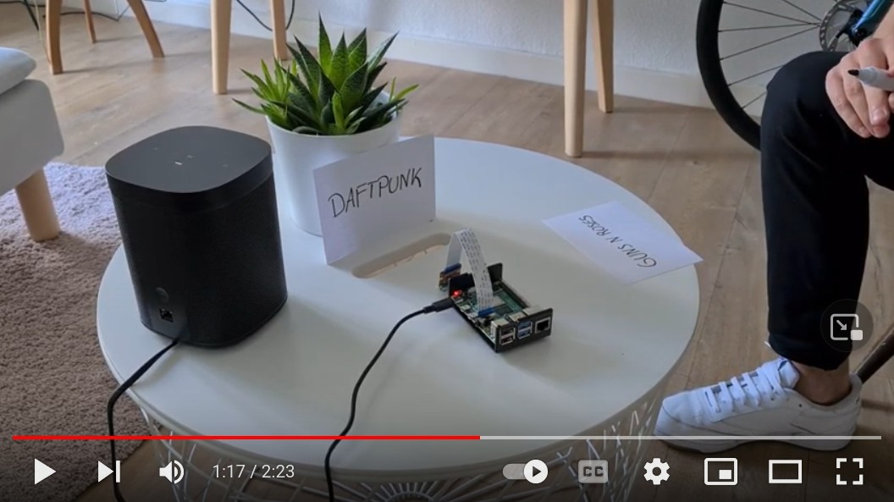

# Music request by message in a bottle

Just playing in the sandbox... :) 

## Topics touched

* Control Sonos Box via SoCo
* Raspberry Pi Camera Module v2
* Deploy @raspi via PyCharm Deployment (ssh)
* Tesseract OCR

## Works on my machine, but well...

* Raspian GNU is deliberately kept slim. Big difference between local machine and edge device...
* Note that poetry build @ raspi can take decades for packages like opencv.
* Note this [Pi Camera issue](https://github.com/waveform80/picamera/issues/604) with python 3.8.1. Upgrade to 3.8.2 solved it.

## What to do on raspi

* Enable camera module via ``sudo raspi-config``
* Install pyenv on raspi which is [straightforward](https://github.com/pyenv/pyenv#installation).
* Install pyenv-virtualenv is [straightforward](https://github.com/pyenv/pyenv-virtualenv).
* Install poetry is [straightforward](https://python-poetry.org/docs/#installation).
* [Install tesseract on Raspi](https://www.macheronte.com/en/how-to-install-tesseract-ocr-on-raspberry-pi/)
* [Install pillow dependencies](https://stackoverflow.com/questions/44043906/the-headers-or-library-files-could-not-be-found-for-jpeg-installing-pillow-on)
* Checkout repo and poetry install 
* ``cd run`` and ``make run``

## TBC

* Replace tesseract with pre-trained and tuned tf model
* Search and use or build API für apple music or spotify
* Use video recognition instead of picture sequence

